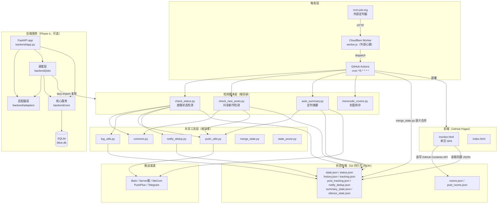
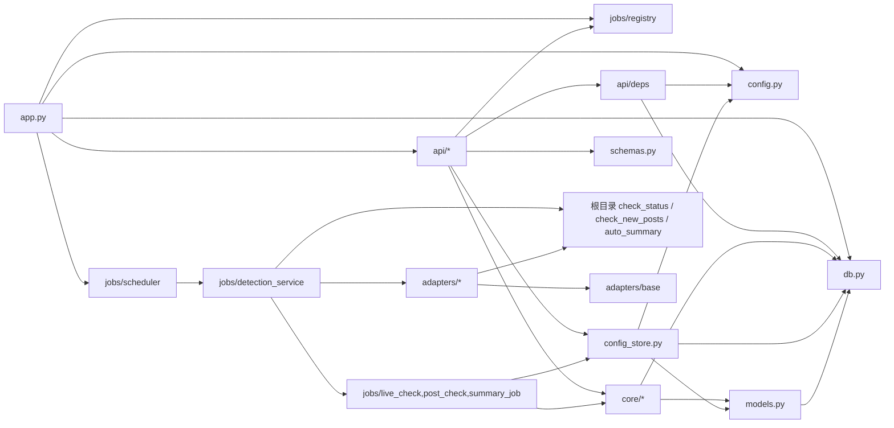
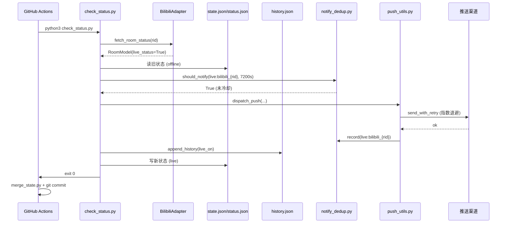
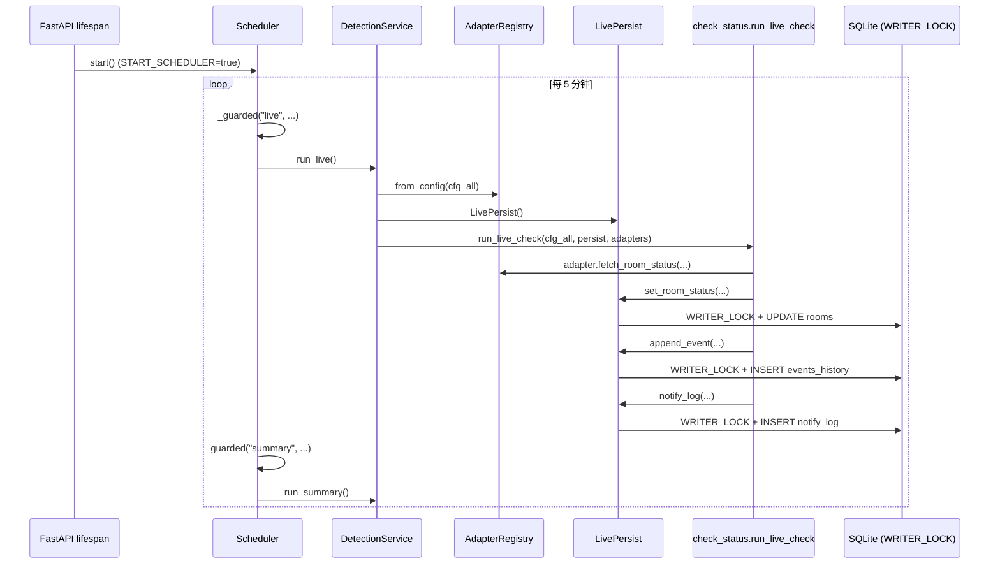
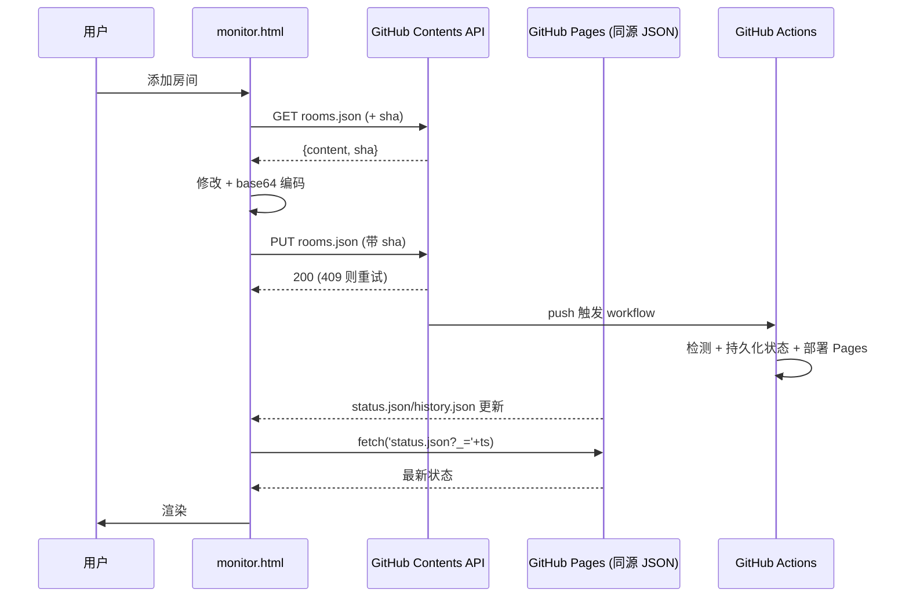

# blive-monitor · Code Wiki

> 本文档是对 `racheko-lab/blive-monitor` 仓库的系统性代码索引，涵盖项目整体架构、主要模块职责、关键类与函数说明、依赖关系以及运行方式。
>
> 文档基线：仓库 Phase 4 阶段（FastAPI + SQLite 后端 + 静态前端 + GitHub Actions CI 并存的双轨架构）。

---

## 目录

1. [项目概览](#1-项目概览)
2. [技术栈与依赖](#2-技术栈与依赖)
3. [整体架构](#3-整体架构)
4. [目录结构](#4-目录结构)
5. [后端架构详解](#5-后端架构详解)
   - 5.1 [应用入口 app.py](#51-应用入口-apppy)
   - 5.2 [配置层 config.py / config_store.py](#52-配置层-configpy--config_storepy)
   - 5.3 [数据层 db.py / models.py / schemas.py](#53-数据层-dbpy--modelspy--schemapy)
   - 5.4 [核心服务层 backend/core](#54-核心服务层-backendcore)
   - 5.5 [适配器层 backend/adapters](#55-适配器层-backendadapters)
   - 5.6 [作业调度层 backend/jobs](#56-作业调度层-backendjobs)
   - 5.7 [API 路由层 backend/api](#57-api-路由层-backendapi)
6. [根目录检测脚本](#6-根目录检测脚本)
7. [前端与静态资源](#7-前端与静态资源)
8. [CI/CD 与部署](#8-cicd-与部署)
9. [运行方式](#9-运行方式)
10. [依赖关系总览](#10-依赖关系总览)
11. [数据流与时序](#11-数据流与时序)

---

## 1. 项目概览

**项目名称**：`blive-monitor`（B 站 / 抖音直播监控 + 多渠道推送）

**定位**：一个轻量级、零成本、面向个人用户的直播与内容监控中枢。它监控 Bilibili（B 站）和 Douyin（抖音）的直播间状态，在状态变化（开播 / 下播 / 抖音新作发布）时通过多渠道（Bark / Server 酱 / 企业微信群机器人 / PushPlus / Telegram）推送通知。

**双轨架构**：项目当前处于「静态前端 + CI 脚本」向「FastAPI + SQLite 后端」演进的过渡阶段，两条运行路径并存：

| 运行路径 | 状态 | 说明 |
|---|---|---|
| **静态 + CI 路径（生产主路径）** | 生产可用 | GitHub Actions 每 5 分钟 cron 触发检测脚本，状态以 JSON 文件持久化回 Git 仓库，静态前端通过 GitHub Pages 提供 |
| **后端服务路径（Phase 4）** | 可选 / 实验性 | FastAPI + SQLite + APScheduler 自驱动调度，Docker 部署，REST API |

**核心能力**：
- 直播状态检测（B 站批量官方 API、抖音 SSR 多策略解析）
- 抖音新作品检测（移动端 / 桌面端 / 计数三层策略，Playwright 破解风控）
- 多渠道推送（带重试、去重、静默时段）
- 统一日志与历史事件（30 分钟节流、500 条上限）
- 定时摘要投递（daily / weekly）
- 封面图转存（绕过抖音防盗链）
- 多平台适配器框架（快手 / 视频号 / 小红书 / 淘宝直播，部分为骨架）

---

## 2. 技术栈与依赖

### 运行时依赖（`requirements.txt`，Python ≥ 3.8，镜像用 3.11-slim）

| 依赖 | 版本 | 用途 |
|---|---|---|
| `playwright` | 1.58.0 | 仅 `check_new_posts.py` 用于抖音新作品检测（headless Chromium 破解签名 / 风控） |
| `fastapi` | 0.128.2 | Phase 4 Web 框架 |
| `uvicorn` | — | ASGI 服务器 |
| `sqlalchemy` | 2.0.51 | 同步 ORM（SQLite 方言，零额外依赖） |
| `apscheduler` | 3.11.3 | 后端自驱动调度器（`AsyncIOScheduler`） |
| `httpx` | — | HTTP 客户端（common / push_utils 复用） |
| `python-multipart` | — | 表单 / 文件导入端点（预留） |
| `pydantic` | — | 请求 / 响应模型 |

> 直播状态检测路径仅用 Python 标准库（`logging`、`urllib`、`json`、`os`、`calendar`、`subprocess`、`logging.handlers.RotatingFileHandler`）。

### 开发依赖（`requirements-dev.txt`）

- `pytest>=8.0` —— 回归测试
- `pyyaml>=6.0` —— `test_refactor_edge` 校验 workflow YAML

### 前端

- 纯 HTML + 原生 JavaScript（`monitor.html` 等），无构建工具、无框架
- 前端直接读写 `rooms.json` / `post_rooms.json`（通过 GitHub Contents API，GET → 修改 → 带 `sha` PUT，409 重试）
- Token 存于浏览器 `localStorage`；推送配置用 `libsodium` 加密后写入 `BLIVE_CONFIG` Actions Secret

### 部署

- GitHub Actions + GitHub Pages（推荐）
- Netlify（仅静态）
- Docker / docker-compose（Phase 4 后端）
- Cloudflare Worker（外部触发器 + CORS 代理，CORS 代理已弃用）

---

## 3. 整体架构



**架构要点**：
- **静态路径**：CI 脚本 → JSON 状态文件 → Git 提交 → Pages 重建；前端直接读写 GitHub API
- **后端路径**：FastAPI 提供 REST API，APScheduler 自驱动，复用根目录检测脚本的核心逻辑（通过 lazy-import + 持久化门面 Facade 解耦）
- **两条路径共享**：检测脚本、推送工具、去重逻辑（后端通过 `Persist Facade` 鸭子类型适配，使旧脚本不直接 import SQLAlchemy）

---

## 4. 目录结构

```
blive-monitor/
├── backend/                    # Phase 4 FastAPI + SQLite 后端
│   ├── adapters/               # 多平台适配器层
│   │   ├── base.py             # 抽象基类 PlatformAdapter + RoomModel/PostModel
│   │   ├── registry.py         # AdapterRegistry 平台注册表
│   │   ├── bilibili.py         # B 站适配器（封装 check_status.fetch_bilibili_batch）
│   │   ├── douyin.py           # 抖音适配器（直播 + 新作）
│   │   ├── kuaishou.py         # 快手适配器
│   │   ├── channels.py         # 微信视频号适配器（骨架）
│   │   ├── xhs.py              # 小红书适配器（骨架）
│   │   └── taobao_live.py      # 淘宝直播适配器
│   ├── api/                    # REST 路由层（/api/v1）
│   │   ├── deps.py             # 共享依赖（鉴权 + DB 会话）
│   │   ├── rooms.py            # 监控目标 CRUD
│   │   ├── posts.py            # 新作品查询/写入
│   │   ├── events.py           # 历史事件查询
│   │   ├── notify.py           # 通知日志 + 去重
│   │   ├── config_api.py       # BLIVE_CONFIG 读写
│   │   ├── summary_api.py      # 摘要状态
│   │   ├── silence_api.py      # 静默状态
│   │   └── jobs_api.py         # 手动触发检测 + 调度状态
│   ├── core/                   # 核心服务层
│   │   ├── persistence.py      # 主持久化门面（rooms/posts/events）
│   │   ├── dedup.py            # 去重账本
│   │   ├── history_store.py    # 历史事件写入（带节流）
│   │   └── notify_log_store.py # 推送审计日志
│   ├── jobs/                   # 作业调度层
│   │   ├── scheduler.py        # APScheduler 封装
│   │   ├── detection_service.py# 检测编排入口
│   │   ├── live_check.py       # LivePersist 门面
│   │   ├── post_check.py       # PostPersist 门面
│   │   ├── summary_job.py      # SummaryPersist 门面
│   │   ├── transcode_job.py    # 封面转存（后端版）
│   │   └── registry.py         # Scheduler 单例注册
│   ├── app.py                  # FastAPI 应用入口
│   ├── config.py               # 环境变量配置
│   ├── config_store.py         # JSON 状态表读写（ConfigKV/Summary/Silence）
│   ├── db.py                   # SQLite 引擎 + 会话工厂 + 写锁
│   ├── models.py               # 8 张 ORM 表
│   └── schemas.py              # Pydantic 请求/响应模型
├── docs/                       # 设计文档与 Mermaid 图
├── tests/                      # pytest 测试套件
├── tools/                      # 运维工具（JSON→DB 迁移、历史类型回填等）
├── assets/covers/              # 转存后的封面图（Git 跟踪）
├── config/platforms.example.json # 多平台配置模板
├── .github/workflows/check.yml # CI 主工作流
│
├── # 根目录检测脚本（静态路径核心）
├── check_status.py             # 直播状态检测
├── check_new_posts.py          # 抖音新作检测
├── auto_summary.py             # 定时摘要
├── transcode_covers.py         # 封面转存
│
├── # 根目录共享工具
├── common.py                   # 通用工具（时间、JSON、路由、模板）
├── log_utils.py                # 日志 + history.json
├── push_utils.py               # 多渠道推送
├── notify_dedup.py             # 去重账本（JSON 版）
├── merge_state.py              # CI 状态语义合并
├── state_prune.py              # 级联清理
│
├── # 前端
├── monitor.html                # 唯一正式前端（SPA）
├── monitor-dashboard.html      # 重定向壳 → monitor.html?view=dashboard
├── monitor-feed.html           # 重定向壳 → monitor.html?view=feed
├── monitor-hero.html           # 重定向壳 → monitor.html?view=hero
├── index.html                  # 入口页
├── api/rooms.js                # 房间输入校验工具
├── libsodium.js                # 前端加密库
│
├── # Cloudflare Worker
├── worker.js                   # 外部心跳触发器
├── cors-proxy-worker.js        # CORS 代理（已弃用）
│
├── # 状态文件（运行时生成，Git 跟踪）
├── rooms.json / post_rooms.json
├── status.json / state.json / tracking.json
├── history.json / post_tracking.json
├── notify_dedup.json
├── summary_state.json / silence_state.json
│
├── Dockerfile / docker-compose.yml
├── run.sh                      # 本地运行封装
├── requirements.txt / requirements-dev.txt
└── pytest.ini
```

---

## 5. 后端架构详解

### 5.1 应用入口 [app.py](file:///workspace/backend/app.py)

**职责**：FastAPI 应用构造、路由挂载、生命周期管理（DB 初始化 + 可选调度器启动）。

**关键要素**：
- `API_PREFIX = "/api/v1"` —— 路由挂载前缀
- `app = FastAPI(title="blive-monitor backend", version="0.4.0", lifespan=lifespan)` —— 全局单例
- `lifespan(app)` —— 异步上下文管理器：启动时 `db.init_db()`（幂等建表），根据 `START_SCHEDULER` 环境变量决定是否构造并启动 `Scheduler`；关闭时停止调度器
- `_should_start_scheduler() -> bool` —— 解析 `START_SCHEDULER` 真值（`1/true/yes/on`），默认 `False`（避免测试/导入/迁移脚本误启）
- `GET /healthz` —— 免鉴权健康检查，返回 `{"status": "ok"}`
- **鉴权模型**：写路由通过 `require_auth` 依赖校验 `X-Bearer-Token` 头；`AUTH_TOKEN` 为空则开放
- **设计取舍**：路由用同步 `def`（非 `async def`），FastAPI 推入线程池，与同步 SQLAlchemy 配合

**挂载的 8 个路由**：`rooms`、`posts`、`events`、`notify`、`config_api`、`summary_api`、`silence_api`、`jobs_api`

### 5.2 配置层 [config.py](file:///workspace/backend/config.py) / [config_store.py](file:///workspace/backend/config_store.py)

#### config.py —— 环境变量驱动配置

所有常量在导入时求值，适合 Docker / 测试注入：

| 常量 | 默认值 | 说明 |
|---|---|---|
| `DB_PATH` | `BLIVE_DB_PATH` → `DATA_DIR/blive.db` → `<repo>/data/blive.db` | SQLite 路径 |
| `AUTH_TOKEN` | `""` | Bearer Token（空 = 开放） |
| `ENABLE_POST_CHECK` | `True` | 新作品检测开关 |
| `TZ` | `Asia/Shanghai` | 时区 |
| `LIVE_CHECK_INTERVAL_MIN` | `5` | 直播检测间隔（分钟） |
| `POST_CHECK_INTERVAL_MIN` | `10` | 新作检测间隔（分钟） |
| `MISFIRE_GRACE_SEC` | `60` | 误火容忍 / 重叠保护 |
| `LIVE_DEDUP_COOLDOWN_SEC` | `7200` | 直播去重冷却（2 小时） |
| `COVERS_DIR` / `GITHUB_OWNER/REPO/BRANCH` | — | 封面转存配置 |
| `PUBLIC_PATHS` | `["/healthz"]` | 免鉴权路径 |

#### config_store.py —— ConfigStore

**职责**：三张 JSON 状态表（`ConfigKV`、`SummaryState`、`SilenceState`）的薄封装。整个 `BLIVE_CONFIG` 文档以单条 KV 存于 `ConfigKV(key='blive_config')`，使旧的 `dispatch_event(cfg_all, ...)` 调度逻辑无需修改。

**关键类与方法**：

```python
class ConfigStore:
    def get_config() -> Dict[str, Any]              # 读取 BLIVE_CONFIG（含默认值兜底）
    def put_config(cfg: Dict) -> str                 # 覆盖 BLIVE_CONFIG，返回 updated_at
    def get_push_cfg() -> Dict                       # 单渠道推送配置（legacy）
    def get_platform_cfg(platform: str) -> Dict      # 多平台适配器配置
    def get_summary_state() / put_summary_state()    # 摘要状态（合并 upsert + 可选字段移除）
    def get_silence_state() / put_silence_state()    # 静默状态（合并 upsert）
```

- `CONFIG_SECTIONS`：允许的顶层节（`channels/routes/templates/silence/summary/push/platforms`），未知节仅告警不拒绝
- 所有写操作在 `db.WRITER_LOCK` 保护下执行；`_upsert_kv_state` 采用合并 upsert，保留其他流程写入的字段（如 `lastSent`）

### 5.3 数据层 [db.py](file:///workspace/backend/db.py) / [models.py](file:///workspace/backend/models.py) / [schemas.py](file:///workspace/backend/schemas.py)

#### db.py —— SQLite 访问层

- 引擎：SQLite（单文件），`check_same_thread=False`（调度线程 + API 线程共享）
- PRAGMA（每连接）：`journal_mode=WAL`、`synchronous=NORMAL`、`foreign_keys=ON`
- `WRITER_LOCK = threading.Lock()` —— **全局单写序列化锁**，所有写操作必须持有，防止 `database is locked`
- `SessionLocal`：`expire_on_commit=False`，避免跨线程懒加载问题
- `init_db()`：幂等 `Base.metadata.create_all(engine)`（无 Alembic，建表由 ORM 模型驱动）
- `get_db()`：FastAPI 依赖，per-request 会话

#### models.py —— 8 张 ORM 表（SQLAlchemy 2.0 风格）

所有时间字段存为北京时间字符串 `"YYYY-MM-DD HH:MM:SS"`，与旧 JSON 字节兼容；`EventHistory.occurred_ts` 额外存 epoch 用于范围查询。

| 表 | 类 | 主键 | 唯一约束 | 用途 |
|---|---|---|---|---|
| `rooms` | `Room` | `id` | `(platform, external_id, kind)` | 监控目标（live/post 通过 `kind` 区分） |
| `posts` | `Post` | `id` | `(platform, post_id)` | 新作品 |
| `events_history` | `EventHistory` | `id` | — | 统一事件日志（替代 history.json） |
| `notify_log` | `NotifyLog` | `id` | — | 推送审计（每次发送尝试一行） |
| `notify_dedup` | `NotifyDedup` | `key` | — | 去重账本（替代 notify_dedup.json） |
| `config_kv` | `ConfigKV` | `key` | — | 通用 KV（BLIVE_CONFIG 在 key='blive_config'） |
| `summary_state` | `SummaryState` | `key` | — | 摘要状态 |
| `silence_state` | `SilenceState` | `key` | — | 静默状态 |

**关系**：
- `Room` ↔ `EventHistory`：`back_populates`，`cascade="all, delete-orphan"`，FK `ondelete="SET NULL"`（删房间保留历史）
- `Room.key` 属性：`f"{platform}_{external_id}"`（旧 JSON key 等价物）
- `Room.meta`（JSON）：承载各平台运行时基线（直播基线 / 新作基线），避免 schema 频繁变更
- `Post` 不与 `Room` 建 FK —— 基线存于 `Room.meta`

#### schemas.py —— Pydantic v2 模型（API 契约）

- 房间：`RoomBase` → `RoomCreate` / `RoomUpdate`（部分更新）/ `RoomStatusUpdate` / `RoomStatusOut` / `RoomOut`
- 作品：`PostCreate` / `PostOut`
- 事件：`EventOut`（只读，镜像 `EventHistory`）
- 通知：`NotifyLogIn` / `NotifyLogOut` / `DedupUpsert` / `DedupQueryOut`
- 状态：`SummaryStateOut` / `SilenceStateOut`
- 通用：`HealthOut` / `JobTriggerOut` / 分页信封 `PagedRooms` / `PagedEvents` / `PagedPosts`（`{total, items}`）
- 响应模型统一 `model_config = {"from_attributes": True}`，可直接从 ORM 实例构造

### 5.4 核心服务层 [backend/core](file:///workspace/backend/core)

四个存储类，统一采用 `_session_scope` 上下文管理器 + 写操作持 `WRITER_LOCK` 约定。只读方法跳过锁，写方法 `with db.WRITER_LOCK: with self._session_scope() as s:`。

#### [persistence.py](file:///workspace/backend/core/persistence.py) —— Persistence

主 DB 读写门面（`rooms` / `posts` / `events_history`）：

```python
class Persistence:
    # 房间
    list_rooms(kind, platform, enabled, q, limit, offset) / count_rooms(...)
    get_room(room_id) / get_room_by_key(platform, external_id, kind)
    upsert_room(data)                    # 持锁，返回 detached 副本
    update_room(room_id, data)           # 持锁，返回 in-session 对象
    delete_room(room_id)                 # 持锁
    # 状态/基线
    get_room_status(platform, external_id, kind)
    get_tracking(platform, external_id, kind) -> dict(room.meta)
    set_room_status(*, platform, external_id, kind, name, result,
                    meta_update, now_str, status_item)  # 持锁，规范状态写入
    # 事件
    append_event(entry)                  # 持锁，无节流原始插入
    list_events(...) / count_events(...)
    # 作品
    upsert_post(data) / get_post / list_posts / count_posts
```

#### [dedup.py](file:///workspace/backend/core/dedup.py) —— DedupService

去重账本（`NotifyDedup`），语义继承旧 `notify_dedup.py`：
- 常量：`LIVE_COOLDOWN_SECONDS=7200`、`PERMANENT=math.inf`、`LIVE_KEY_TTL_SECONDS=7天`、`MAX_ENTRIES=5000`
- `should_notify(key, cooldown, now)` —— 只读
- `record(key, now, meta)` —— 持锁 upsert（**仅在推送成功后调用**，避免「标记但失败」抑制下次重试）
- `last_sent_at(key)`、`prune(now)`（清理超期 live 键 + 裁剪到上限）

#### [history_store.py](file:///workspace/backend/core/history_store.py) —— HistoryStore

统一历史事件写入（带 30 分钟节流）：
- `ERROR_THROTTLE_MINUTES=30`，`_THROTTLE_TYPES={"error","cookie_warn"}`
- `_suppressed(rid, etype, now_str)` —— 只读查询最近是否已有同类事件
- `append_event(entry) -> bool` —— 节流命中返回 `False` 不写；否则委托 `Persistence.append_event`

#### [notify_log_store.py](file:///workspace/backend/core/notify_log_store.py) —— NotifyLogStore

推送审计账本（`NotifyLog`）：
- `log(channel_id, event_type, content_hash, status, target, sent_at)` —— 持锁插入，返回 detached 副本
- `list_logs(...)` —— 只读过滤查询

### 5.5 适配器层 [backend/adapters](file:///workspace/backend/adapters)

**设计契约**（`docs/phase3_design.md §3/§8`）：适配器只做 **获取 + 归一化**，绝不直接写 DB/JSON。所有持久化与推送经编排层回流。

#### [base.py](file:///workspace/backend/adapters/base.py) —— 抽象基类与归一化模型

**数据模型**（dataclass，对齐 ORM）：
- `RoomModel`：`platform, room_id, name, title, live_status(bool), url, cover, avatar, tags, online, area, extra`
- `PostModel`：`platform, post_id, author, url, cover, published_at, title, extra`

**异常层级**：
- `AdapterError(Exception)` —— 适配器检测错误基类
- `AdapterSkip(AdapterError)` —— 跳过该账号（`reason ∈ {no_sec_uid, poisoned, playwright_required}`）
- `AdapterGated(AdapterError)` —— 被风控 / 未登录（等价旧 `cookie_warn`）

**抽象基类** `PlatformAdapter(ABC)`：

| 类属性 | 默认 | 说明 |
|---|---|---|
| `platform` | `""` | 平台码（必须覆写） |
| `poll_interval` | `300` | 默认轮询秒 |
| `rate_limit` | — | `{max_requests, window_sec, backoff_sec}` |
| `supports_live` | `True` | 是否支持直播检测 |
| `supports_posts` | `True` | 是否支持新作品 |
| `needs_context` | `False` | 是否需 Playwright 上下文 |

**抽象方法**：
- `fetch_room_status(self, room_id: str) -> RoomModel`
- `fetch_new_posts(self, author_or_room, since=None, baseline=None, context=None) -> List[PostModel]`

**带默认实现**：
- `fetch_room_status_batch(room_ids)` —— 默认逐个调用，仅 Bilibili 覆写
- `apply_credentials(context)` —— 凭证注入钩子，默认 no-op

#### [registry.py](file:///workspace/backend/adapters/registry.py) —— AdapterRegistry

```python
_PLATFORM_CLASSES = {
    "kuaishou": KuaishouAdapter,
    "channels": ChannelsAdapter,
    "xhs": XhsAdapter,
    "taobao_live": TaobaoLiveAdapter,
}  # bilibili / douyin 不在此，from_config 中无条件实例化

class AdapterRegistry:
    register(adapter) -> self       # 按 platform 注册
    get(platform)                   # 取适配器或 None
    list_platforms()
    @classmethod from_config(cls, cfg_all)  # 按 BLIVE_CONFIG 构建
```

`from_config` 总是注册 `BilibiliAdapter` + `DouyinAdapter`（内置），再遍历 `cfg_all["platforms"]` 对 `enabled=True` 的平台按配置实例化；单平台构建失败被捕获并记录，不阻断其他平台（隔离要求）。

#### 各平台适配器

| 平台码 | 类 | 常驻 | 直播 | 新作 | needs_context | 实现状态 |
|---|---|---|---|---|---|---|
| `bilibili` | `BilibiliAdapter` | 是 | ✅ | ❌ | 否 | 生产可用 |
| `douyin` | `DouyinAdapter` | 是 | ✅ | ✅ | 是 | 生产可用 |
| `kuaishou` | `KuaishouAdapter` | 否 | 🟡 | 🟡 | 否 | 部分可用 |
| `channels` | `ChannelsAdapter` | 否 | 🟡 | 🟡 | 是 | 骨架 |
| `xhs` | `XhsAdapter` | 否 | ❌ | 🟡 | 是 | 骨架 |
| `taobao_live` | `TaobaoLiveAdapter` | 否 | 🟡 | ❌ | 否 | 部分可用 |

**认证模式**：
- bilibili：无（公开 `getRoomBaseInfo`）
- douyin：登录 Cookie 注入 Playwright（破 aweme API 风控）；直播 SSR 无需认证
- kuaishou：`did`（可匿名生成）+ 可选登录 `cookie` + `client_key`
- channels：`app_id` + `access_token`（开放平台）或 `session` cookie（Playwright）
- xhs：登录 `cookie` + `x-s/x-t/x-bogus` 签名（需签名器库）
- taobao_live：登录 `cookie` + 正常浏览器 UA

**BilibiliAdapter**：薄封装 `check_status.fetch_bilibili_batch`（官方批量 `getRoomBaseInfo`），保留 `replay(2)` 状态语义于 `extra["raw_live_status"]`。

**DouyinAdapter**：
- 直播：封装 `check_status.fetch_douyin`（SSR 多策略）
- 新作：`resolve_sec_uid` → `get_latest_aweme` → `should_notify_new_post` → `should_update_baseline`；含 `unique_id` 防投毒校验；支持 `api` / `count` 两种基线模式；就地修改 `baseline`（含 `sec_uid`/`latest_aweme_id`/`latest_ct`/`mode` 等）

**KuaishouAdapter**：直播走 `live_api/liveroomDetail`（失败回退 SSR `_room_from_html`）；新作走 GraphQL `visionProfilePhotoList`（签名/登录态待接入）

**TaobaoLiveAdapter**：仅直播，SSR 解析 `window.__INITIAL_STATE__` / `__INIT_DATA__`

### 5.6 作业调度层 [backend/jobs](file:///workspace/backend/jobs)

#### [scheduler.py](file:///workspace/backend/jobs/scheduler.py) —— Scheduler（APScheduler 封装）

- 引擎：`AsyncIOScheduler`，时区取 `config.TZ`
- 触发器：`IntervalTrigger`（非 cron 表达式）
  - 直播：每 `LIVE_CHECK_INTERVAL_MIN`（默认 5 分钟），始终注册
  - 新作：每 `POST_CHECK_INTERVAL_MIN`（默认 10 分钟），受 `ENABLE_POST_CHECK` 门控
- 重叠保护：APScheduler `max_instances=1` + `coalesce=True` + `misfire_grace_time`，叠加进程内 `RUNNING_FLAGS` 字典重入锁
- 同步检测代码通过 `asyncio.to_thread` 派发到工作线程，保持事件循环响应

```python
class Scheduler:
    async _guarded(name, coro_fn)   # 重入保护 + 异常吞没
    async _live_job()               # → run_live，再链式 run_summary（懒求值，避免动态 cron）
    async _post_job()               # → run_post，再链式 run_transcode
    start()                         # 注册 interval 任务并启动
    shutdown()
    trigger(type_)                  # 手动触发：'live' / 'post' / 'all'
```

**作业图**：
- `_live_job`（interval）→ `run_live` → `run_summary`（链式，各自独立重入保护）
- `_post_job`（interval，可选）→ `run_post` → `run_transcode`（链式）
- `summary` 与 `transcode` 无独立触发器，分别搭载在 live / post 轮次末尾

#### [detection_service.py](file:///workspace/backend/jobs/detection_service.py) —— DetectionService

编排入口，lazy-import 旧检测模块并喂入鸭子类型持久化门面：

```python
class DetectionService:
    def __init__(self, config_store=None)
    def run_live(adapters=None)     # lazy-import check_status + AdapterRegistry，
                                    # 建 LivePersist，调 check_status.run_live_check(...)
    def run_post(context=None, adapters=None)  # lazy-import check_new_posts，建 PostPersist
    def run_summary()               # lazy-import auto_summary，建 SummaryPersist
    def run_transcode()             # import transcode_job.run()
```

**解耦策略**：旧检测模块（`check_status` / `check_new_posts` / `auto_summary` / `transcode_covers`）从不直接 import SQLAlchemy，只通过 `persist` 门面对象读写。

#### 持久化门面（per-job Persist Facade）

| 门面 | 所在文件 | 适配的旧函数 | 组合依赖 |
|---|---|---|---|
| `LivePersist` | [live_check.py](file:///workspace/backend/jobs/live_check.py) | `check_status.run_live_check` | Persistence + DedupService + HistoryStore + NotifyLogStore |
| `PostPersist` | [post_check.py](file:///workspace/backend/jobs/post_check.py) | `check_new_posts.run_post_check` | 同上 |
| `SummaryPersist` | [summary_job.py](file:///workspace/backend/jobs/summary_job.py) | `auto_summary.run_summary` | ConfigStore + Persistence |

- `LivePersist.dedup_should_notify` 默认冷却 `LIVE_DEDUP_COOLDOWN_SEC`（2 小时）
- `PostPersist.dedup_should_notify` 默认冷却 `float("inf")`（永久去重 per key）
- 三者均暴露 `notify_log(channel_id, event_type, content_hash, status, target)` 记录投递结果

#### [transcode_job.py](file:///workspace/backend/jobs/transcode_job.py)

后端版封面转存：读 `Room(kind='post').meta.latest_cover`（CDN URL），下载到 `config.COVERS_DIR/{platform}_{external_id}.jpg`，回写 `meta.latest_cover` 为 GitHub raw URL，并镜像到 `Post.cover`。复用 `transcode_covers.download_cover` / `_raw_url` / `_sha256`。

#### [registry.py](file:///workspace/backend/jobs/registry.py)

模块级单例注册表，存当前活跃 `Scheduler`。`app.py` 生命周期 `set_scheduler(...)`，`jobs_api` 通过 `get_scheduler()` 取用，避免与 `scheduler.py` 循环导入。

### 5.7 API 路由层 [backend/api](file:///workspace/backend/api)

所有路由 `APIRouter(prefix=..., tags=[...])`，挂在 `/api/v1` 下。**统一约定：读端点免鉴权；写端点 `dependencies=[Depends(require_auth)]`**。

#### [deps.py](file:///workspace/backend/api/deps.py)
- `get_db_session` —— 别名 `backend.db.get_db`
- `require_auth(x_bearer_token: str = Header(None, alias="X-Bearer-Token"))` —— `AUTH_TOKEN` 空则放行，否则校验头，不符抛 401

#### 端点清单

| 模块 | 方法 | 路径 | 鉴权 | 说明 |
|---|---|---|---|---|
| rooms | GET | `/rooms` | 否 | 列表（kind/platform/enabled/q/limit/offset） |
| rooms | POST | `/rooms` | 是 | upsert RoomCreate |
| rooms | GET | `/rooms/{id}` | 否 | 单个 |
| rooms | PUT | `/rooms/{id}` | 是 | 更新 RoomUpdate |
| rooms | DELETE | `/rooms/{id}` | 否 | 删除，204 |
| rooms | GET | `/rooms/{id}/status` | 否 | 状态快照 |
| rooms | PUT | `/rooms/{id}/status` | 是 | 写状态 RoomStatusUpdate |
| posts | GET | `/posts` | 否 | 列表（platform/author/since/limit/offset） |
| posts | POST | `/posts` | 是 | 写 PostCreate |
| events | GET | `/events` | 否 | 历史事件分页（room_id/platform/event_type/frm/to） |
| notify | POST | `/notify/log` | 是 | 记录推送日志 |
| notify | GET | `/notify/dedup?key=` | 否 | 查去重 |
| notify | POST | `/notify/dedup` | 是 | 标记去重 |
| config_api | GET | `/config` | 否 | 读 BLIVE_CONFIG |
| config_api | PUT | `/config` | 是 | 覆盖，返回 updated_at |
| summary_api | GET | `/summary/state` | 否 | 摘要状态 |
| summary_api | PUT | `/summary/state` | 是 | 更新摘要状态 |
| silence_api | GET | `/silence/state` | 否 | 静默状态 |
| silence_api | PUT | `/silence/state` | 是 | 更新静默状态 |
| jobs_api | POST | `/jobs/check?type=` | 是 | 手动触发检测（live/post/all），202 |
| jobs_api | GET | `/jobs/status` | 否 | 调度状态（running flags + scheduler 是否在运行） |

> **注**：`events.py` 尽管名为 events，但**不实现 SSE/流式**。它是普通的同步分页 GET，返回单个 `PagedEvents` JSON。整个 `backend/` 无 `StreamingResponse` / `text/event-stream`。

---

## 6. 根目录检测脚本

这些是静态 + CI 路径的核心，也是后端 `DetectionService` lazy-import 复用的对象。

### [check_status.py](file:///workspace/check_status.py) —— 直播状态检测
- B 站：官方批量 `getRoomBaseInfo` API
- 抖音：SSR HTML 多策略解析（RENDER_DATA / share_meta / text）
- 更新 `status.json` / `state.json` / `history.json` / `tracking.json`
- offline→live 跳变时通过 `push_utils` 多渠道推送
- 含 `BILIBILI_STATUS_MAP`（状态码映射）、`fetch_bilibili_batch`、`fetch_douyin`（被适配器复用）
- 提供 `run_live_check(cfg_all, persist, now, adapters)` —— 后端编排入口

### [check_new_posts.py](file:///workspace/check_new_posts.py) —— 抖音新作品检测
- 与直播监控完全解耦（读 `post_rooms.json`，写 `post_tracking.json`）
- **三层策略**（优雅降级）：
  1. 移动端 `m.douyin.com` legacy `web/api/v2/aweme/post/`（无需 cookie，返回真实作品列表）
  2. 桌面端 `aweme/v1/web/aweme/post/`（需 `douyin_cookie`）
  3. 回退 `aweme_count`（`user/profile/other`）
- `sec_uid` 解析（仅从房主 `anchor` 字段）+ `unique_id` 防投毒交叉校验
- 关键函数：`resolve_sec_uid`、`get_latest_aweme`、`should_notify_new_post`、`should_update_baseline`、`apply_douyin_cookie`、`load_douyin_cookie`（被适配器复用）
- 提供 `run_post_check(cfg_all, persist, now, context, adapters)`

### [auto_summary.py](file:///workspace/auto_summary.py) —— 定时摘要
- 按 `BLIVE_CONFIG.summary` 门控；聚合 `history.json` 中 `live_on`/`new_post` 事件（自 daily/weekly 截止点起，UTC 秒数学与前端 JS `computeSummary` 对齐）
- 调 `push_utils.dispatch_push`；写 `summary_state.json`（成功记 `lastSent`，失败记 `lastFailedAt`/`lastFailedSince` 供冷却）
- 永远 exit 0（非致命，CI 配 `continue-on-error`）
- 提供 `run_summary(cfg_all, persist, now)`

### [transcode_covers.py](file:///workspace/transcode_covers.py) —— 封面转存
- 用 stdlib `urllib.request` 下载抖音作品封面到 `assets/covers/`
- 改写 `post_tracking[id].latest_cover` 为 `raw.githubusercontent.com` URL（绕过抖音防盗链）
- 差分提交：`<covers_dir>/.manifest.json`（`{id:{aweme_id, sha256}}`）避免重复下载
- 失败保留 CDN URL 下轮重试
- 关键函数：`download_cover`、`_raw_url`、`_sha256`（被 `transcode_job` 复用）

### 共享工具

| 文件 | 职责 |
|---|---|
| [common.py](file:///workspace/common.py) | `bjnow()`（北京时间）、`parse_beijing()`（北京串→UTC 秒，与前端 JS 字节一致）、`load/save_json_file`（`.tmp`+`os.replace` 原子写）、`load_silence_cfg`、`should_skip_by_silence`、A2/A4 统一路由钩子 `resolve_channel` / `render_template` |
| [log_utils.py](file:///workspace/log_utils.py) | `HISTORY_MAX=500` 单一来源；`init_runtime_logging()`（控制台 + `RotatingFileHandler` 5MB×5，含 `%(account)s` 上下文）；`load/append/cap_history`；统一事件模型 `EVENT_TYPES`（`live_on/live_off/new_post/error/cookie_warn/system`）、`STATUS_TO_TYPE`、`dedupe_by_throttle`（error/cookie_warn 每 rid+type 30 分钟节流） |
| [push_utils.py](file:///workspace/push_utils.py) | `SendResult` dataclass（`ok/attempts/last_error/status_code`）、`is_retryable`（5xx/429/网络可重试，4xx/配置/认证永久失败）、`send_with_retry`（指数退避，默认 3 次 2s/4s/8s）、各渠道 `send_via_*`、`dispatch_push`/`dispatch_push_ok`；re-export `resolve_channel`/`render_template` |
| [notify_dedup.py](file:///workspace/notify_dedup.py) | 第二道去重账本（JSON 版）：直播键 `live:{platform}_{rid}` 2 小时冷却（吸收抖音闪屏 live→offline→live），新作键 `post:{sec_uid}:{aweme_id}` 永久；直播键 TTL 7 天，账本上限 5000 |
| [merge_state.py](file:///workspace/merge_state.py) | CI 持久化步骤的状态合并器：**字段级语义合并**（替代脆弱的 `git pull --rebase`）。`notify_dedup` 取并集保最早 ts；`post_tracking` 每账号取更新基线；`post_rooms` 按 id 并集；`state/tracking` 取本地；`history` 按 time+name 并集裁到上限。用法 `python3 merge_state.py origin/master` |
| [state_prune.py](file:///workspace/state_prune.py) | 级联清理纯函数 + 原子写：`prune_history_orphans`（按 `f"{platform}\|{rid}"` 保留）、`prune_tracking_orphans`（按 `douyin_{rid}`）、`merge_post_rooms_fields`（重读磁盘仅更新现存账号的 `sec_uid`/`name`，防止「复活」前端已删账号） |

---

## 7. 前端与静态资源

### [monitor.html](file:///workspace/monitor.html) —— 唯一正式前端（单页 SPA）
- 自包含（内联 CSS + 大段内联 `<script>`），约 5000+ 行
- 启动读 `?view=` 参数（`readViewParam()`）：`dashboard` 开仪表盘 tab；`feed` 开日志 tab 预筛 `type=new_post`；`hero` 落默认日志视图
- **数据源**：
  - 写 `rooms.json` / `post_rooms.json`：直接调 GitHub Contents API（`ghGetFile` → 修改 → 带 `sha` `PUT`，409 重试）
  - 读运行时数据：同源静态 JSON（`fetch('status.json?_='+t)` 等，`AbortSignal.timeout(8000)`）
  - 可触发 CI workflow（`POST .../actions/workflows/check.yml/dispatches`）—— 用户添加 post-room 后强制刷新 sec_uid/nickname
- Token：优先 `localStorage`，回退页面内嵌 `DEFAULT_GH_TOKEN`
- 可触发 CI workflow（`POST .../actions/workflows/check.yml/dispatches`）—— 用户添加 post-room 后强制刷新 sec_uid/nickname

### [index.html](file:///workspace/index.html) —— 入口页
列四个候选 UI，`monitor.html?v=20260713b` 标「当前正式版」并视觉强调，其余三个标「备选方案」。

### monitor-dashboard/feed/hero.html —— 重定向壳
Option A「四视图整合」后降为 ~20 行重定向壳，均跳转 `monitor.html?view=xxx`。功能上只有一套前端实现。

### [api/rooms.js](file:///workspace/api/rooms.js) —— RoomValidator
纯 JS 校验工具：`PLATFORMS=["bilibili","douyin"]`、`validateInput(body)`、`key(room)`→`"platform|id"`、`dedupe(rooms)`。无 HTTP 调用，纯逻辑契约。

### [worker.js](file:///workspace/worker.js) —— Cloudflare Worker 外部心跳
- `scheduled(event, env, ctx)`：POST `.../actions/workflows/check.yml/dispatches` `{"ref":"master"}`，用 `env.GH_TOKEN`
- `fetch(request, env)`：同 dispatch，暴露为 HTTP 端点（供 cron-job.org 触发）

### [cors-proxy-worker.js](file:///workspace/cors-proxy-worker.js) —— CORS 代理（已弃用）
读 `?url=`，校验目标主机 ∈ `['api.live.bilibili.com','live.douyin.com']`，加移动 UA + Referer 转发，返回带 `Access-Control-Allow-Origin: *`。

---

## 8. CI/CD 与部署

### [.github/workflows/check.yml](file:///workspace/.github/workflows/check.yml)

**名称**：「直播状态检测」
**触发**：`schedule: cron "*/5 * * * *"`、`workflow_dispatch`、`push`（paths: `rooms.json`, `post_rooms.json`）
**并发**：`group: live-check`，`cancel-in-progress: false`（串行，防并发覆盖 / 重复推送）

**三个 Job**：

1. **check**（ubuntu, Python 3.11）
   - 顶部统一算 `WIN_MIN=$(date -u +%-M)`，让新作检测与封面转存共享同一 15 分钟窗口
   - `FORCE_POST_CHECK=true` 仅 push 事件（用户改 `post_rooms.json` 立即检测）
   - 条件安装 Playwright + Chromium（仅 `post_rooms.json` 非空时）
   - 跑 `check_status.py`（直播）
   - 跑 `check_new_posts.py`（仅 UTC 分钟为 15 倍数或 `FORCE_POST_CHECK`）
   - 跑 `transcode_covers.py`（同 15 分钟窗口）
   - `auto_summary.py`（`continue-on-error: true`）
   - **持久化状态**：配 git author → `git fetch origin master` → `merge_state.py origin/master`（语义合并）→ 复制合并后 JSON 到临时目录 → `git reset --hard origin/master` → 还原 → `git add -f` 被 `.gitignore` 忽略的状态文件 → `strip_status.py` 条件性 stage `status.json` → 有意义 diff 则提交 "📡 update state [skip ci]"，否则 30 天 keepalive touch；push 失败重试 2 次（含再合并）
   - 上传 runtime 日志为 artifact
   - **构建 Pages**：复制 `monitor.html`、`monitor-*.html`、`index.html`、`libsodium.js` 及各 JSON 到 `_site/`，`upload-pages-artifact@v3`

2. **test**（独立）：装 `requirements*.txt`，跑 `pytest -q`

3. **deploy**（needs check）：`deploy-pages@v4`

**关键洞察**：CI 把 Git 仓库本身当权威状态存储（`status.json`/`history.json`/`notify_dedup.json` 等），`merge_state.py`（语义合并）+ `strip_status.py`（时间戳剥离 diff）是去重/防噪机制。Pages 站每次运行从工作区副本重建。

### tools/

| 文件 | 职责 |
|---|---|
| [import_json_to_db.py](file:///workspace/tools/import_json_to_db.py) | 一次性 JSON→SQLite 迁移（幂等可重跑）。读 `rooms.json`/`status.json`/`state.json`/`tracking.json`/`post_rooms.json`/`post_tracking.json`/`history.json`/`notify_dedup.json`/`summary_state.json`/`silence_state.json`，经 `Persistence`/`DedupService` 写入；`events_history` 清空重插保证确定性；`BLIVE_CONFIG` 环境变量 → `ConfigKV(key='blive_config')` |
| [migrate_history_types.py](file:///workspace/tools/migrate_history_types.py) | 回填 `history.json` 旧条目缺失的 `type`/`level`（`type` 由 `status` 经 `log_utils.type_from_status` 推导，`level` 由 `type` 经 `level_from_type`），已有不覆盖（幂等）。支持 `--dry-run` |
| [strip_status.py](file:///workspace/tools/strip_status.py) | CI 持久化步骤辅助：`strip_volatile(d)` 去掉 `status.json` 的 `updated`/per-room `time`/`live_duration`（恒变字段），比较本地与 `HEAD:status.json`，有意义变化才 `git add -f`，否则跳过（防「每 5 分钟空提交」） |

---

## 9. 运行方式

### 9.1 本地开发

```bash
# 安装
pip install -r requirements-dev.txt     # pytest + pyyaml
pip install -r requirements.txt         # playwright + Phase 4 后端依赖

# 测试
python -m pytest -q

# 本地运行检测脚本
./run.sh once        # 检测直播状态一次
./run.sh posts       # 检测抖音新作（需 ENABLE_POST_CHECK=true）
./run.sh all         # 两者
./run.sh loop        # 持续，每 60 秒
```

`run.sh` 是 `set -euo pipefail` bash 封装，按参数分发（`once`/`check`/`1`、`posts`/`2`、`all`/`3`、`loop`/`watch`/`4`、`help`）。推送配置经 `BLIVE_CONFIG` 环境变量（JSON），新作检测经 `ENABLE_POST_CHECK=true`。

### 9.2 CI（生产主路径）

GitHub Actions workflow 每 5 分钟跑 `check_status.py`（+ 可选 `check_new_posts.py`），状态 JSON 回写 Git，`monitor.html` 部署到 GitHub Pages。因 GitHub `schedule` 触发不可靠，建议外部定时器（如 cron-job.org）POST 到 workflow `dispatches` 端点作第二保障（`worker.js` 即此触发器）。

### 9.3 Docker（Phase 4 后端）

**Dockerfile**：`python:3.11-slim`，`WORKDIR /app`，先装 `requirements.txt`（层缓存），拷源码，`mkdir -p /app/data /app/assets/covers`，设 `BLIVE_DB_PATH=/app/data/blive.db`、`BLIVE_COVERS_DIR=/app/assets/covers`、`TZ=Asia/Shanghai`，暴露 8000，`CMD uvicorn backend.app:app --host 0.0.0.0 --port 8000`。

**docker-compose.yml**：单服务 `blive-monitor`，构建自 `.`，映射 `8000:8000`，环境变量：
- `AUTH_TOKEN`（可选 Bearer，空 = 无鉴权）
- `START_SCHEDULER`（默认 `false`；设 `true` 让后端自驱动检测）
- `TZ=Asia/Shanghai`

卷：`./data:/app/data`（SQLite）、`./assets/covers:/app/assets/covers`（转存封面）。`restart: unless-stopped`。

```bash
docker compose up -d --build
# 后端自驱动检测：
START_SCHEDULER=true docker compose up -d --build
```

### 9.4 关键环境变量

| 变量 | 作用 |
|---|---|
| `BLIVE_CONFIG` | 推送配置 JSON（env / Actions Secret） |
| `ENABLE_POST_CHECK` | `true`/`false` 新作检测开关 |
| `DOUYIN_COOKIE` | 抖音 cookie（`BLIVE_CONFIG` 嵌入的替代） |
| `BLIVE_DB_PATH` | 后端 SQLite 路径 |
| `AUTH_TOKEN` | 后端写 API Bearer |
| `START_SCHEDULER` | 后端是否自驱动 |
| `SUMMARY_RETRY_COOLDOWN` | 摘要失败冷却（秒，默认 4 小时） |

### 9.5 配置文件格式

**rooms.json**：`[{ "platform": "bilibili"|"douyin", "id": <room-id>, "name": <显示名> }]`（B 站 id 为直播间号；抖音 id 为 `web_rid`）

**post_rooms.json**：同形，可选预解析 `sec_uid`：`{ "id", "name", "sec_uid": "MS4w..." }`

**BLIVE_CONFIG**：`{ "push": { "type": "<channel>", ...channel-fields }, "douyin_cookie": "<optional>", "summary": {...} }`。渠道 `type` ∈ `bark`(url,group?) / `wecom`(webhook) / `serverchan`(sendkey) / `pushplus`(token,topic?) / `telegram`(token,chat)。Legacy `{"sendkey":"SCT..."}` 自动当作 serverchan。

**config/platforms.example.json**：前瞻多平台模板，顶层 `platforms` 按 `kuaishou/channels/xhs/taobao_live` 键，每项 `enabled` / `credentials`（平台特定）/ `poll_interval` / `rate_limit`。

---

## 10. 依赖关系总览

### 后端内部依赖



### 关键解耦点

1. **适配器只读不写**：`adapters/*` 仅返回 `RoomModel`/`PostModel`，所有持久化经编排层回流
2. **旧脚本与 ORM 解耦**：`DetectionService` 通过鸭子类型 `Persist Facade`（`LivePersist`/`PostPersist`/`SummaryPersist`）喂入旧检测函数，旧模块从不 import SQLAlchemy
3. **单写锁**：`db.WRITER_LOCK` 全局序列化所有写，解决 SQLite 多线程竞争
4. **Scheduler 单例**：`jobs/registry` 打破 `jobs_api` ↔ `scheduler` 循环依赖
5. **CI 语义合并**：`merge_state.py` 用 Python 字段级合并替代脆弱的 `git pull --rebase`，根除并发推送重复问题

### 外部依赖

- **GitHub API**：Contents API（前端读写 rooms.json）、Actions workflow_dispatch（触发检测）、Pages（部署前端）
- **Bilibili**：`getRoomBaseInfo` 批量官方 API（公开）
- **Douyin**：SSR 页面（直播）+ aweme 列表 API（新作，需 cookie + Playwright）
- **推送渠道**：Bark / Server 酱 / 企业微信 / PushPlus / Telegram
- **Cloudflare Worker**：`worker.js`（外部心跳）、`cors-proxy-worker.js`（CORS 代理，已弃用）

---

## 11. 数据流与时序

### 11.1 直播检测推送时序（offline → live）



### 11.2 后端自驱动检测时序（Phase 4）



### 11.3 前端读写 rooms.json



---

## 附录：模块速查表

| 需求 | 静态路径 | 后端路径 |
|---|---|---|
| 直播检测 | `check_status.py` | `DetectionService.run_live` → `check_status.run_live_check` |
| 新作检测 | `check_new_posts.py` | `DetectionService.run_post` → `check_new_posts.run_post_check` |
| 摘要投递 | `auto_summary.py` | `DetectionService.run_summary` → `auto_summary.run_summary` |
| 封面转存 | `transcode_covers.py` | `DetectionService.run_transcode` → `transcode_job.run` |
| 推送 | `push_utils.dispatch_push` | 同左（旧模块内调用） |
| 去重 | `notify_dedup.py`（JSON） | `core/dedup.py`（SQLite `NotifyDedup`） |
| 历史事件 | `log_utils.append_history`（JSON） | `core/history_store.HistoryStore`（SQLite `events_history`） |
| 状态持久化 | JSON 文件（Git 跟踪） | `core/persistence.Persistence`（SQLite `rooms`） |
| 状态合并 | `merge_state.py`（字段级语义合并） | 不需要（单 DB，WRITER_LOCK 串行） |
| 调度 | GitHub Actions cron（5 分钟） | `jobs/scheduler.Scheduler`（APScheduler interval） |
| 前端 | `monitor.html`（读同源 JSON + 写 GitHub API） | 同左（前端未对接后端 REST） |
| 鉴权 | 前端 Token in localStorage | `AUTH_TOKEN` + `X-Bearer-Token` |

---

*本文档由代码静态分析生成，反映仓库当前状态。设计动机与路线图详见 `docs/` 下各 `*_design.md` / `*_prd.md`。*
